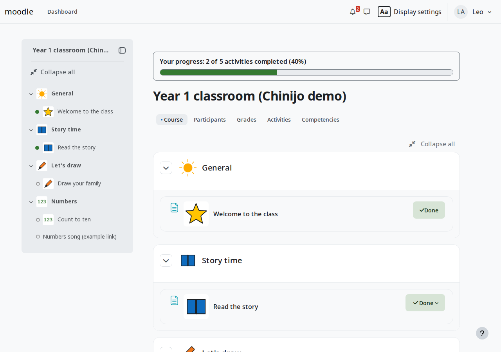

# Chinijo — tema accesible para Moodle

*English version: [README.md](README.md).*

**Chinijo** (`theme_chinijo`) es un tema accesible para [Moodle](https://moodle.org)
basado en Boost, creado para EVAGD, el entorno virtual de aprendizaje de la
Consejería de Educación del Gobierno de Canarias. Está pensado para los primeros
cursos de Educación Primaria y para el alumnado con necesidades específicas de
apoyo educativo (NEAE): páginas tranquilas, texto y zonas de pulsación más
grandes, ajustes de visualización personales, progreso del curso y apoyo con
pictogramas, sin quitar ninguna función de Moodle.



*Captura real del tema en Moodle 5.3 con datos sintéticos de demostración.*

> **Estado:** versión de desarrollo 0.1.0 (alfa). Las comprobaciones automáticas
> pasan en local de Moodle 4.5 a 5.3 (Behat y axe-core en 4.5 y 5.3). Quedan **pendientes** las pruebas manuales
> de accesibilidad con lectores de pantalla y dispositivos, las pruebas en la
> preproducción de EVAGD y la recepción institucional.

## Funciones

- **Ajustes de visualización** de cada persona: alto contraste; tamaño del texto
  (normal, grande, muy grande, enorme); tipo de letra fácil de leer (Atkinson
  Hyperlegible); espacio entre letras, palabras y líneas hasta los valores de
  WCAG 2.2 (1.4.12); reducir animaciones (siempre se respeta la preferencia del
  sistema). Se guardan como preferencias propias de cada usuario (solo durante la
  sesión para invitados); **nadie puede fijarlas a otra persona**. Diálogo accesible
  con teclado desde la barra superior y la página de acceso, y una página que
  funciona sin JavaScript.
- **Progreso del curso** con los datos de finalización de Moodle (las mismas cifras
  que el área personal), actualizado solo cuando Moodle confirma el cambio.
- **Aviso amable** al marcar una actividad como hecha.
- **Pictogramas** que el profesorado añade a secciones y actividades (PNG, JPEG o
  WebP, texto alternativo, autoría y licencia en los créditos; se copian con las
  copias de seguridad del curso). Los nombres se mantienen siempre. El tema no
  incluye ningún pictograma.
- **Aviso de financiación europea (FEDER)** configurable: emblema aprobado, texto
  alternativo y texto de reconocimiento (pendiente de los recursos aprobados).
- Interfaz en inglés y en español.

## Compatibilidad

Moodle 4.5 LTS (PHP 8.3), 5.0, 5.1, 5.2 y 5.3 LTS (PHP 8.4). Desde Moodle 5.1 el
tema se instala en `public/theme/chinijo`; en 4.5 y 5.0, en `theme/chinijo`.
Detalles en [docs/compatibility.md](docs/compatibility.md).

## Instalación

```sh
unzip theme_chinijo-<versión>.zip -d <moodle>/public/theme/   # <moodle>/theme/ en 4.5 y 5.0
php admin/cli/upgrade.php --non-interactive
php admin/cli/purge_caches.php
```

Después, elegir Chinijo en *Administración del sitio › Apariencia › Temas*.
Procedimiento completo para EVAGD (preproducción, actualización y marcha atrás):
[docs/deployment-evagd.md](docs/deployment-evagd.md).

## Configuración

- *Administración del sitio › Apariencia › Temas › Chinijo*: color de marca,
  aviso FEDER (emblema, texto alternativo, texto, páginas) y SCSS avanzado.
- Los **ajustes de visualización** no necesitan configuración.
- **Pictogramas**: en el curso, *Más › Pictogramas* (docentes con edición).
  Guía docente: [docs/teacher-guide.es.md](docs/teacher-guide.es.md).

## Probarlo

[Demo en Moodle Playground](https://moodle-playground.com/?blueprint-url=https%3A%2F%2Fraw.githubusercontent.com%2Fateeducacion%2Fmoodle-theme_chinijo%2Fmain%2Fblueprint.json)
(funciona cuando el tema esté publicado en la rama `main` de GitHub). Cuentas de
demostración desechables: `student1`, `student2`, `teacher1`, `admin`; contraseña
`Chinijo-demo-1234`.

## Desarrollo

Requisitos: Docker con Compose v2, GNU Make y un intérprete POSIX.

```sh
make up                      # Moodle 5.3 + PostgreSQL 17 con el tema montado y activo
make seed                    # datos sintéticos de demostración
make up MOODLE_VERSION=4.5   # LTS anterior
make lint && make test && make coverage
make help                    # todas las órdenes
```

Antes de cambiar código, lee [AGENTS.md](AGENTS.md) y [CONTRIBUTING.md](CONTRIBUTING.md).

## Accesibilidad

Objetivo: WCAG 2.2 AA, EN 301 549 v3.2.1, RD 1112/2018 y WAI-ARIA 1.2. Las
pruebas automáticas (axe-core) no demuestran por sí solas la conformidad; la
revisión manual está pendiente. Ver [docs/accessibility.md](docs/accessibility.md),
[docs/accessibility-audit.md](docs/accessibility-audit.md) y el borrador de
[declaración de accesibilidad](docs/accessibility-statement-draft.es.md).

## Licencia

© 2026 Área de Tecnología Educativa (ATE), Consejería de Educación, Gobierno de
Canarias. Licencia [GNU GPL versión 3 o posterior](LICENSE). Basado en el tema
Boost de Moodle. Tipografía Atkinson Hyperlegible (Braille Institute of America,
licencia SIL OFL 1.1). Los pictogramas que se usen en los cursos pertenecen a sus
autores y conservan sus licencias (por ejemplo, ARASAAC, CC BY-NC-SA 4.0).

Vulnerabilidades: [SECURITY.md](SECURITY.md).
